# HR Skills — Project Roadmap

> **Repository:** [`tuanductran/hr-skills`](https://github.com/tuanductran/hr-skills)
> **Current version:** `v1.0.3` · **License:** MIT · **Runtime:** Bun `1.3.14` · **Orchestrator:** Turborepo `2.10.4`
> **Maintainer:** Tuan Duc Tran · **Status:** Actively maintained, pre-1.0 in spirit despite semver `1.x`

This document is a living, maintainer-level roadmap reverse-engineered directly from the repository contents (skills, packages, configuration, CI, and history). It is meant to be committed at the repository root and updated as the project evolves.

---

## Table of contents

1. [Project vision](#project-vision)
2. [Current repository overview](#current-repository-overview)
3. [Architecture roadmap](#architecture-roadmap)
4. [Monorepo roadmap](#monorepo-roadmap)
5. [Skills ecosystem roadmap](#skills-ecosystem-roadmap)
6. [Build system roadmap](#build-system-roadmap)
7. [Validation roadmap](#validation-roadmap)
8. [Documentation roadmap](#documentation-roadmap)
9. [Developer experience roadmap](#developer-experience-roadmap)
10. [Testing roadmap](#testing-roadmap)
11. [CI/CD roadmap](#cicd-roadmap)
12. [Security roadmap](#security-roadmap)
13. [Performance roadmap](#performance-roadmap)
14. [Refactoring roadmap](#refactoring-roadmap)
15. [Missing features](#missing-features)
16. [Release roadmap](#release-roadmap)
17. [Prioritized backlog](#prioritized-backlog)
18. [Technical debt](#technical-debt)
19. [Success metrics](#success-metrics)
20. [Long-term vision](#long-term-vision)
21. [Appendix](#appendix)

---

## Project vision

### What this project is

**HR Skills** is a Bun/Turborepo monorepo that packages **146 domain-specific [Agent Skills](https://agentskills.io/)** for Human Resources and Talent Acquisition professionals, distributed as `SKILL.md` files consumable by **Claude Code** and **claude.ai**. Alongside the content library, the repository ships two internal TypeScript packages (`hr-skills-build`, `skills-ref`) that validate, sync, and programmatically consume those skills, plus a `.claude-plugin/marketplace.json` manifest that turns the whole collection into an installable Claude plugin marketplace.

Unlike a typical "prompt collection" repo, this project treats skill content as **structured, versioned, schema-validated software artifacts** — every `SKILL.md` has required frontmatter, required sections, line-count ceilings, and an automated validator that runs in CI. That is the defining architectural decision of the whole repository: **content is code**.

### Who it is for

- HR managers, HRBPs, and People Ops professionals who want Claude to behave like a domain expert instead of a generalist when handling recruiting, compliance, comp & benefits, or workforce-planning tasks.
- Technical recruiters and TA teams hiring for engineering/product/design roles, served by the 18 software-engineering-hiring specialist skills (`hr-frontend`, `hr-backend`, `hr-devops`, `hr-blockchain`, `hr-embedded`, etc.).
- Vietnam-based or Vietnam-adjacent HR teams, served by the dedicated `hr-vietnam-context` skill, which the root router treats as a **standing cross-cutting differentiator**, not an edge case.
- Contributors and maintainers extending the library — the `.agents/` directory encodes an entire second audience: AI coding agents and human maintainers who need repository-specific conventions to safely add or refactor skills.
- Downstream consumers of the `skills-ref` TypeScript library, who want to validate or programmatically consume Agent-Skills-formatted content outside this repository (it's explicitly framed as a "reference library for Agent Skills," not an HR-specific tool).

### Long-term mission

Become the most complete, best-governed, and most trustworthy open-source Agent Skills library for a single professional domain (HR), serving as both a usable product (install-and-go skills) and a reference implementation for how a large skills library should be engineered, validated, and released.

### Ecosystem

The repository sits at the intersection of three ecosystems:

- **Agent Skills format** (`agentskills.io`) — the open specification this repo's `SKILL.md` files conform to.
- **Claude Code / claude.ai plugin ecosystem** — distribution via `.claude-plugin/marketplace.json` and direct directory copy into `~/.claude/skills/`.
- **skills.sh** — a third-party skills discovery/installation index the README already badges and links (`npx skills add tuanductran/hr-skills`), which is the second install path documented in `AGENTS.md`'s branch strategy (`main` = "the publishing branch").

### Design philosophy

- **Content is code.** Skills are validated with the same rigor as TypeScript source: schema-checked frontmatter, required sections, length ceilings, blank-line-before-list Markdown rules enforced by a custom validator — not just markdownlint.
- **Router, don't repeat.** The root `SKILL.md` is explicitly documented as carrying "no HR opinions" — it is a pure dispatcher to the 146 specialized skills, keeping domain knowledge in exactly one place per topic.
- **Progressive disclosure.** `SKILL.md` is described in `AGENTS.md` as "an overview, not an exhaustive manual" — deeper material is pushed into optional `content/`, `prompts/`, and `examples/` directories so the base skill stays inside a shared context budget (hard 500-line ceiling, enforced by `validateLineCount`).
- **Intentional heterogeneity.** The README explicitly states that varying levels of skill completeness (`SKILL.md`-only vs. fully-fleshed skills with `content/`, `prompts/`, `examples/`) is a deliberate design choice, not an oversight — though this roadmap will show the current split (76 bare / 34 partial / 36 full) is skewed further toward "bare" than is ideal for a mature library.

### Architectural philosophy

Bun-first, zero-Node-required, workspace-catalog-driven dependency management, Turborepo-orchestrated task graph, and a strict TypeScript configuration (`strict`, `noUncheckedIndexedAccess`, `exactOptionalPropertyTypes`, `verbatimModuleSyntax`) that treats the two internal packages with the same discipline as a public npm library, even though both are currently marked `"private": true"` / `"version": "0.0.0"`.

### AI philosophy

The repository is built **for** AI agents to consume (skills), **by** AI agents in part (Claude Code commands `.claude/commands/*.md`, an entire `.agents/skills/` meta-layer of repository-maintenance skills), and **about** AI in HR (an `hr-ai-*` and `hr-agentic-ai` skill cluster covering AI governance, ethics, privacy, adoption, and change management inside HR itself). This three-layer relationship with AI is unusual and worth preserving deliberately as the project grows.

### Documentation philosophy

Documentation follows **Atlassian's content design guidelines** by explicit mandate in `AGENTS.md` (sentence case headings, no `e.g./i.e./etc./&`, contractions allowed, inclusive "they/their" pronouns). This is a rare level of prose-style rigor for an open-source repo and should be treated as a first-class convention, not a suggestion.

### Validation philosophy

Validation is layered: a generic **Agent Skills conformance layer** (`skills-ref`) checks frontmatter shape against the open format; a **repository-specific policy layer** (`hr-skills-build`) checks HR-repo conventions (author name, 8–12 tasks, 4–6 tips, blank-line rules, 500-line ceiling). This separation of "is this a valid Agent Skill" from "does this meet *our* bar" is a strength worth generalizing further (see [Skills Ecosystem Roadmap](#skills-ecosystem-roadmap)).

### Open source philosophy

MIT-licensed content, Apache-2.0-licensed `skills-ref` library (a deliberate split — the reusable library uses a more permissive/patent-safe license than the HR content), CODEOWNERS pinned to a single maintainer, GitHub issue templates that route bug reports and feature requests by *area* (skill content vs. tooling vs. CI vs. docs), and a strict `main`/`dev` branch model where `main` is described as "the publishing branch" for the `npx skills add` / skills.sh installation flow.

---

## Current repository overview

### Repository statistics

| Metric | Count | Notes |
|---|---:|---|
| HR skill packages (`skills/hr-*`) | **146** | Discovered via `getHrSkills()` at runtime; matches `.claude-plugin/marketplace.json` plugin count exactly (146) |
| Maintainer/meta skills (`.agents/skills/*`) | **12** | `biome`, `bun`, `turbo`, `typescript`, `valibot`, `markdown`, `pdf`, `humanizer`, `skill-vetter`, `hr-skills-maintaining`, `hr-root-router-maintaining`, `github-awesome-copilot-git-commit` |
| Total `SKILL.md` files | **159** | 146 HR + 12 `.agents` + 1 root router |
| Skills with `content/` | **~70** | Human-readable companion guidance per domain |
| Skills with `examples/` | **~70** | Practical end-to-end workflow files |
| Skills with `prompts/` | **~36** | Reusable, topic-grouped prompt libraries |
| **Bare skills (`SKILL.md` only)** | **76 (≈52%)** | No `content/`, `prompts/`, or `examples/` at all — includes all recently-added skills, which shipped `SKILL.md`-only per the "bare is an acceptable starting tier" convention |
| **Fully-fleshed skills (all three dirs)** | **36 (≈25%)** | The "gold standard" tier |
| **Partial skills (`content/` + `examples/`, no `prompts/`)** | **34 (≈23%)** | The largest structured-but-incomplete tier |
| Internal TypeScript packages | **2** | `packages/hr-skills-build`, `packages/skills-ref` |
| Unit test files | **9** | 5 in `skills-ref`, 4 in `hr-skills-build` |
| GitHub Actions workflows | **3** | `lint.yml`, `test.yml`, `typecheck.yml` — **no release/publish workflow** |
| Claude Code slash commands | **4** | `new-skill`, `validate`, `sync-and-validate`, `release-check` |
| Markdown documentation files (root-level) | **~10** | `README.md`, `AGENTS.md`, `.agents/AGENTS.md`, `CONTRIBUTING.md`, `CODE_OF_CONDUCT.md`, `SECURITY.md`, `CHANGELOG.md`, `docs/format.md`, `.claude-plugin/README.md`, `SKILL.md` (root router) |
| Released versions (CHANGELOG) | `v1.0.0` → `v1.0.3` | First release 2026-02-27; patch-only releases since |

### Main technologies

| Layer | Technology |
|---|---|
| Runtime & package manager | **Bun** `1.3.14` (npm/pnpm/Yarn explicitly forbidden via `preinstall: bunx only-allow bun`) |
| Monorepo orchestration | **Turborepo** `2.10.4` (`turbo.jsonc`: `build`, `dev`, `typecheck`, `test`, `validate`, `sync` tasks) |
| Language | **TypeScript** `6.0.3`, strict mode, ESM-only, `verbatimModuleSyntax` |
| Schema validation | **Valibot** `1.4.2` (not Zod — explicitly documented, with a dedicated `.agents/skills/valibot/SKILL.md` warning against confusing the two) |
| Library bundler | **tsdown** `0.22.3` (used by `skills-ref`, not by `hr-skills-build`, which runs directly via `bun src/*.ts`) |
| Formatter/linter | **Biome** `2.5.3` (tabs, width 4, 90-col lines, single quotes) |
| Markdown QA | `markdownlint-cli`, `case-police`, `markdown-link-check` |
| Commit discipline | **Commitlint** (`@commitlint/config-conventional`, 72-char header max) + **Lefthook** git hooks |
| Release automation | **changelogen** (`bun run release` → bump, changelog, commit, tag, push) |
| Dependency automation | **Renovate** (grouped by tool) *and* **Mend/Whitesource** (`.whitesource`) — two overlapping bots |
| CLI prompts (build tooling) | `@clack/prompts` |
| Unused-code detection | **Knip** |

### Workspace architecture

```text
hr-skills/ (root workspace, private, version 1.0.3)
├── packages/*                     ← Bun workspace glob
│   ├── hr-skills-build/           ← app-like tooling package (validate, sync)
│   └── skills-ref/                ← publishable-shaped library package
├── skills/hr-*/                   ← 146 content packages (not a Bun workspace member)
├── .agents/skills/*                ← 12 meta/maintainer skills (not a Bun workspace member)
├── .claude/                        ← Claude Code project config (commands, settings)
├── .claude-plugin/                 ← generated marketplace manifest
└── docs/format.md                  ← the Agent-Skills-for-this-repo specification
```

**Important architectural note:** `skills/` and `.agents/` are **not** part of the Bun `workspaces.packages` glob (`packages/*` only). They are plain content directories, discovered at runtime by `hr-skills-build` via `readdir`, not by Bun's workspace resolver. This is correct — they aren't npm packages — but it means the "workspace" mental model only really applies to the two TypeScript packages; the 146+12 skills are a parallel, filesystem-convention-driven system layered on top.

### Package relationships

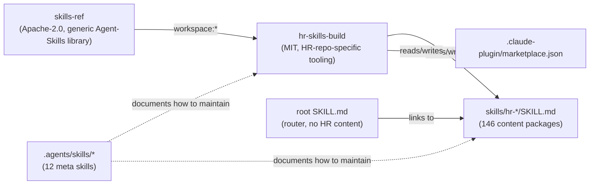

`hr-skills-build` is the only consumer of `skills-ref` today (`dependencies: { "skills-ref": "workspace:*" }`). `skills-ref`'s own `validate` export is re-wrapped by `hr-skills-build/src/validate.ts` (`validateCore`) and extended with eight additional repo-specific checks. This is a clean example of **generic-library-wraps-into-policy-layer** composition — a pattern worth documenting explicitly and reusing if a second content domain is ever added to the monorepo.

### Folder relationships

| Folder | Role | Read by | Written by |
|---|---|---|---|
| `skills/hr-*/` | Source of truth for all HR content | Claude Code, claude.ai, `hr-skills-build` (sync/validate) | Contributors, `.claude/commands/new-skill.md` scaffolder |
| `.claude-plugin/marketplace.json` | Generated distribution manifest | Claude Code marketplace installer | `syncMarketplace()` in `hr-skills-build/src/sync.ts` — **never hand-edited** |
| `packages/skills-ref` | Generic Agent-Skills parser/validator/prompt-builder | `hr-skills-build` | Contributors |
| `packages/hr-skills-build` | Repo-specific policy + CLI scripts | `bun run validate` / `bun run sync` in CI and pre-push hooks | Contributors |
| `.agents/skills/*` | Maintainer-facing meta-skills (how to use Biome/Bun/Turbo/Valibot/TypeScript in *this* repo, how to maintain the router, how to vet third-party skills) | AI coding agents (Claude Code, others) | Contributors |
| `docs/format.md` | Canonical Agent-Skills-for-this-repo spec | Contributors, `CONTRIBUTING.md` links here | Maintainer |

---

## Architecture roadmap

### Current architecture

A two-layer system: (1) a **content layer** of 146 independently-versioned `SKILL.md` packages with optional supporting directories, and (2) a **tooling layer** of two TypeScript packages that discover, validate, and sync that content into a distributable manifest. Turborepo orchestrates the tooling layer's tasks (`build`, `test`, `typecheck`, `validate`, `sync`); the content layer has no build step of its own — a `SKILL.md` file *is* the shipped artifact.

### Desired architecture (near-term)

- Formalize the **skills/** directory as a first-class workspace concept even though it isn't a Bun package — e.g., a `skills.json` or generated `skills/CATALOG.md` (referenced in old CHANGELOG entries but apparently since removed — see [Technical Debt](#technical-debt)) that gives both humans and `skills-ref` consumers a single indexed entry point without needing to `readdir`.
- Introduce a **third package**, e.g. `packages/hr-skills-cli`, that wraps `skills-ref` + `hr-skills-build` behind a proper published CLI (`npx hr-skills validate`, `npx hr-skills new <name>`), so the `.claude/commands/new-skill.md` scaffolding logic (currently duplicated as a large Markdown prompt for Claude Code) becomes real, testable, versioned code.
- Split **`hr-skills-build/src/validate.ts`** (currently one 7 KB file mixing eight independent validation rules with the CLI runner) into a `rules/` directory of single-responsibility validators plus a thin CLI entry point — mirroring the clean separation already present in `packages/skills-ref`.

### Future architecture (longer-term)

- A **remote/registry-aware architecture**: today, `skills-ref`'s `validate()` and `readProperties()` only operate on local directories. A future version could accept remote skill sources (git URLs, npm-published skill bundles) so `skill-vetter` (already scoped for "third-party skills") has something real to vet.
- A **plugin system** for validation rules, so downstream consumers of `skills-ref` (this is explicitly framed as a reusable Agent Skills library, not HR-only) can register custom rule sets the way `hr-skills-build` does today, without forking the package.

### Dependency flow

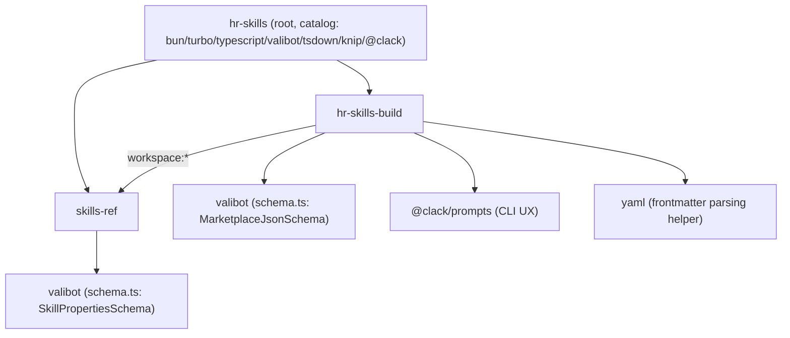

### Data flow (validate)

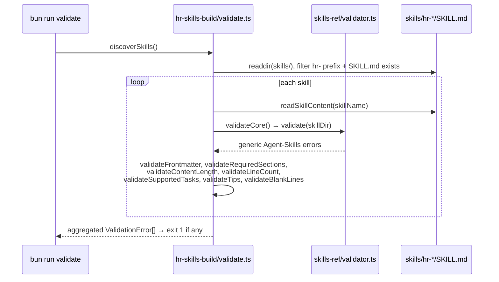

### Skill flow (routing)

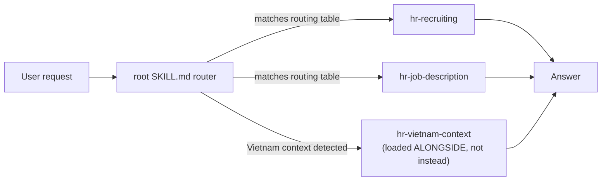

### Validation flow

See [Validation Roadmap](#validation-roadmap) for the full rule inventory; architecturally it is a two-stage pipeline: **generic Agent Skills conformance** (`skills-ref.validate`) → **HR-repo policy** (`hr-skills-build` eight custom checks), both aggregated into one `ValidationError[]` and reported through `@clack/prompts`.

### Build flow

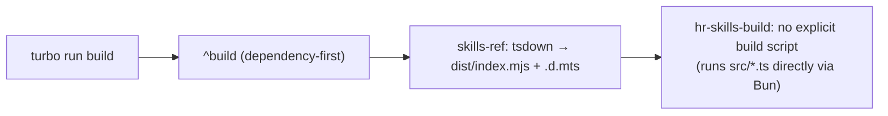

Note the asymmetry: `skills-ref` has a real `build` script (`tsdown`) producing `dist/`; `hr-skills-build/package.json` has **no `build` script at all**, only `validate`, `sync`, `test`, `dev`, `typecheck`. Turborepo's `build` task (`dependsOn: ["^build"]`, `outputs: ["dist/**"]`) will therefore no-op for `hr-skills-build` — this is fine functionally (it's an internal CLI tool, not a library) but is worth an explicit comment in `turbo.jsonc` so future contributors don't assume it's a bug.

### Release flow

`bun run release` → `changelogen --release --patch --push`, driven by `changelog.config.ts` (custom titles/emoji per Conventional Commit type, custom release commit template). **There is no GitHub Actions release workflow** — releases are entirely a local, maintainer-run operation. This is the single biggest gap between "hobby project" and "production-quality release engineering" in the repository (see [CI/CD Roadmap](#cicd-roadmap)).

### Prompt flow

`skills-ref.toPrompt(skillDirs[])` generates an `<available_skills>` XML block (`<skill><name/><description/><location/></skill>` per skill) — this is the same shape Claude's own skill-loading convention uses, confirming `skills-ref` was built to be a **drop-in Agent-Skills toolkit**, not merely an internal helper.

### Documentation flow

`docs/format.md` (spec) → `CONTRIBUTING.md` (process, links to format.md) → `AGENTS.md` (command reference + content-standards mandate) → `.agents/skills/hr-skills-maintaining/SKILL.md` and `.agents/skills/hr-root-router-maintaining/SKILL.md` (AI-agent-executable versions of the same rules). Four documents encode overlapping but not identical versions of the same conventions — a documentation-debt risk flagged in [Refactoring Roadmap](#refactoring-roadmap).

---

## Monorepo roadmap

### `packages/hr-skills-build`

| Aspect | Detail |
|---|---|
| **Purpose** | Repository-specific build/maintenance tooling: discover HR skills, validate them against repo policy, and sync the generated marketplace manifest. |
| **Current status** | ✅ Functional and tested; 🟨 CLI-only, no packaging/publishing (private, version `0.0.0`, never published). |
| **Responsibilities** | Skill discovery (`config.ts`), frontmatter/section/content/task/tip/blank-line validation (`validate.ts`), marketplace sync (`sync.ts`), shared regex constants (`constants.ts`), string helpers (`helpers.ts`), lightweight frontmatter parsing (`parser.ts`), local schema for `marketplace.json` (`schema.ts`), shared types (`types.ts`). |
| **Public API** | None published — consumed only via `bun src/validate.ts` / `bun src/sync.ts` CLI entry points (`if (import.meta.main)` guards). |
| **Internal modules** | 8 source files, ~15.6 KB total; `validate.ts` (7 KB) is by far the largest and most complex, mixing 8 rule functions + the CLI runner. |
| **Dependencies** | `skills-ref` (workspace), `valibot`, `@clack/prompts`, `yaml`. |
| **Consumers** | Root `package.json` scripts (`sync`, `validate` both `turbo run … --filter=hr-skills-build`), `.claude/commands/validate.md` and `sync-and-validate.md`, pre-push/CI. |
| **Future improvements** | Split `validate.ts` into `rules/*.ts` + `cli.ts`; add a `--fix` mode for auto-fixable rules (e.g., missing blank lines); add JSON/SARIF output for CI annotations; expose a programmatic (non-CLI) API so other tools in the monorepo (or future ones) can call validation without shelling out. |
| **Technical debt** | `validate.ts` has zero unit tests directly importing its 7 KB of logic as a single file — tests exist (`validate.test.ts`, `config.test.ts`, `parser.test.ts`, `sync.test.ts`) but a monolithic file makes future refactors riskier than they need to be. No `build`/`clean` script despite CHANGELOG mentioning a "clean" script was added in v1.0.3 — inconsistent with current `package.json`. |
| **Potential refactors** | Extract `discoverSkills()`/`readSkillContent()` (currently in `helpers.ts`, used by `validate.ts`) into `config.ts` alongside `getHrSkills()` for a single "skill discovery" module. |

### `packages/skills-ref`

| Aspect | Detail |
|---|---|
| **Purpose** | Generic, potentially-standalone TypeScript library for reading, validating, and generating LLM-ready prompts from any Agent-Skills-format `SKILL.md` file — explicitly not HR-specific. |
| **Current status** | ✅ Functional, tested, built with `tsdown`, has a real publishable shape (`main`/`module`/`types`/`exports`/`files: ["dist"]`) — but `"private": true"` and `"version": "0.0.0"` mean it is **not actually published to npm** despite being publish-ready. |
| **Responsibilities** | Frontmatter parsing (`parser.ts`), schema validation of `SkillProperties` (`schema.ts`, `SkillPropertiesSchema`), typed errors (`errors.ts`: `SkillError` → `ParseError` / `ValidationError`), directory→properties loading (`loader.ts`: `findSkillMd`, `readProperties`), dict conversion (`models.ts`: `toDict`), prompt XML generation (`prompt.ts`: `toPrompt`), top-level validation (`validator.ts`). |
| **Public API** | `readProperties`, `toPrompt`, `validate` (re-exported from `index.ts` — a deliberately tiny 130-byte barrel file). |
| **Internal modules** | 9 source files, ~15 KB; `validator.ts` (4.2 KB) and `parser.ts` (3.6 KB) are the largest. |
| **Dependencies** | `valibot` only at runtime; `tsdown` as a dev/build dependency. |
| **Consumers** | `hr-skills-build` (only current consumer); documented in its own `README.md` as usable standalone (`import { readProperties, toPrompt, validate } from "skills-ref"`). |
| **Future improvements** | Actually publish to npm (flip `private: false`, bump to `1.0.0`) so the "reusable Agent Skills library" positioning becomes real and testable by outside consumers; add support for the optional `license`/`compatibility`/`allowed-tools` frontmatter fields beyond parse-through (currently just passed to `toDict`, unused elsewhere); add a `SKILL_MD_FILENAMES` fallback test for the alternate filename(s) it apparently supports (`findSkillMd` iterates a list — worth documenting what the alternates are). |
| **Technical debt** | Two different `ValidationError` concepts exist in the codebase: `skills-ref`'s `errors.ts` class (`extends SkillError`) and `hr-skills-build`'s `types.ts` interface (`{ skill, message }`) — same name, different shape, different package. This is a naming collision waiting to confuse a future contributor or IDE auto-import. |
| **Potential refactors** | Rename one of the two `ValidationError` symbols (e.g., `hr-skills-build`'s to `SkillValidationIssue`) to remove the collision; consider re-exporting `skills-ref`'s error classes so `hr-skills-build` can `instanceof`-check instead of string-matching error messages. |

### Cross-package consumer map

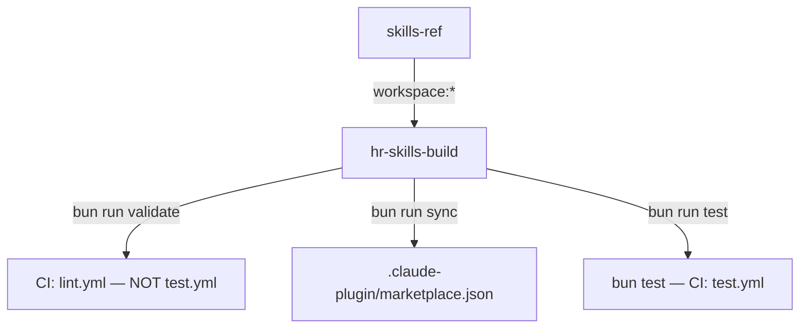

**Note:** `bun run validate` is *not* wired into any of the three GitHub Actions workflows (`lint.yml`, `test.yml`, `typecheck.yml`) — see [CI/CD Roadmap](#cicd-roadmap) for why this matters.

---

## Skills ecosystem roadmap

### Coverage

The 146 HR skills are organized (per the root router) into **12 functional clusters**: Talent Acquisition & Recruiting (26 skills), Onboarding/Offboarding/People Ops (11), Performance/Talent/Career Management (10), Compensation/Benefits/Rewards (6), Learning & Development (7), Org Development/Design/Change (13), Workforce Planning & Analytics (14), HR Technology/Data/AI (16), Compliance/Labor Relations/Risk (10), Culture/Engagement/Experience/Wellbeing (10), Project Management & Global/Local Context (4), and Software-Engineering/Technical Hiring Specialists (19). This is genuinely comprehensive coverage of the modern HR function. ✅ The README's former "40 HR skills" understatement has been fixed — it now states "100+" and points to the root `SKILL.md` router as the single source of truth for the live count and per-cluster breakdown, so it no longer needs manual re-syncing every time the skill count changes (see [Technical Debt](#technical-debt)).

### Missing domains

The five domain gaps identified in the previous edition of this roadmap have all been closed:

- ✅ **HR budgeting & financial planning** — added as `hr-people-budgeting` (people budget by cost center, budget cycles, variance tracking), distinct in scope from `hr-workforce-economics`.
- ✅ **Internal communications tooling specifics** — added as `hr-chatbot-design` (Slack/Teams HR bot conversation flows, escalation design), distinct from the content-focused `hr-employee-communications`.
- ✅ **Retirement/pension specialist guidance** — added as `hr-retirement-benefits`, split out from the general `hr-compensation-benefits` bucket.
- ✅ **HR M&A integration playbooks by country** — added as `hr-ma-integration-by-country`, covering works-council/consultation requirements across major markets (US, EU, India) alongside the existing `hr-mergers-acquisitions` and `hr-post-merger-integration`.
- ✅ **Accessibility/disability accommodation** — added as `hr-accessibility-accommodation`, promoted out of `hr-compliance`'s ADA prompts into a first-class skill.

No further plausible domain gaps have been identified as of this edit; this section should be re-derived the next time the library is audited for coverage.

### Overlap

Some clusters have adjacent skills whose boundaries are only distinguishable by reading full descriptions — a maintenance risk as the library grows:

- `hr-training-development` vs. `hr-learning-development` vs. `hr-learning-strategy`
- `hr-workforce-planning` vs. `hr-strategic-workforce-planning` vs. `hr-workforce-scenario-planning` vs. `hr-workforce-forecasting`
- `hr-talent-management` vs. `hr-talent-acquisition` vs. `hr-talent-intelligence` vs. `hr-talent-mapping` vs. `hr-talent-crm` vs. `hr-talent-supply-chain`
- `hr-organizational-development` vs. `hr-organization-effectiveness` vs. `hr-organizational-design`

This isn't necessarily wrong (HR genuinely has fine-grained sub-disciplines) but it raises the router's cognitive load, and the root `SKILL.md`'s own guidance ("cross-functional requests... may need two or three [skills]") suggests even the maintainer anticipates ambiguity here.

### Consistency

- ✅ 146/146 skills present in the router's routing tables, and 146/146 present in `marketplace.json` — **perfect sync today**, verified directly against the filesystem (this is currently maintained by discipline/manual regeneration, not yet an automated CI rule — see [Missing Features](#missing-features)).
- ⚠ `metadata.author` inconsistency: `.agents/skills/valibot/SKILL.md` uses `author: open-circle` (a third-party-sourced skill) while every other skill in the repo uses `Tuan Duc Tran` — the validator's `validateAuthor()` would reject this if `.agents/skills/` were ever brought under the same validation umbrella as `skills/hr-*/` (currently it is not, since `discoverSkills()` filters by the `hr-` prefix under `skills/` only).
- ⚠ `metadata.version: "1.0"` in the same `valibot` skill breaks the semantic-version convention (`"1.0.0"`) used everywhere else.

### Versioning

All 146 HR skills are pinned in `AGENTS.md`'s root-`SKILL.md` "Notes" section as **"v1.0.0 unless otherwise noted"** — in practice this means the library has **no per-skill version history**; every skill was likely bulk-stamped at `1.0.0` on creation, and there is no tooling today to bump an individual skill's version when its content changes (only the monorepo-level `package.json` version is bumped by `changelogen`). The `.agents/skills/*` meta-skills, by contrast, *do* show real version drift (`bun` at `1.1.1`, `turbo`/`typescript` at `1.1.0`, `github-awesome-copilot-git-commit` at `2.0.0`) — proving the versioning mechanism works when actually used.

### Templates

`CONTRIBUTING.md` and `.claude/commands/new-skill.md` both embed a full `SKILL.md` template inline as Markdown text. They are **two independent copies of the same template** with no shared source of truth — a classic drift risk (see [Refactoring Roadmap](#refactoring-roadmap)).

### Examples & prompts

- 70 skills have `examples/`; 36 have `prompts/`. The **prompts/ directory is the least-adopted optional structure** (~25% of skills) despite `docs/format.md` describing it in the same depth as `content/` and `examples/`. This is the clearest "under-invested" optional layer in the library today.

### Validation (skill-level)

Covered exhaustively in [Validation Roadmap](#validation-roadmap).

### Future expansion

- A **skill maturity model** (Bare → Content → Content+Examples → Full) formalized as a `metadata.maturity` frontmatter field, surfaced in `marketplace.json` and the README, so users can filter for "battle-tested" vs. "stub" skills.
- **Skill deprecation/aliasing support** — as the library grows past 146 skills, some will inevitably need renaming or merging; there is currently no documented deprecation path (only `hr-root-router-maintaining` mentions "renaming a skill directory" as a supported maintenance task, with no corresponding redirect mechanism for users with the old name installed locally).

### Skill quality matrix (representative sample by cluster)

| Skill | Status | Content | Examples | Prompts | Testing | Needs improvement |
|---|---|---|---|---|---|---|
| `hr-recruiting` | ✅ Core/flagship | — | — | — | Validated in CI | Verify still has full `content/`+`examples/`+`prompts/` triad (README's quick-start references it as the canonical first-install skill) |
| `hr-vietnam-context` | ✅ Differentiator | ✅ | ✅ | 🟨 | Validated in CI | Expand `prompts/` — currently the repo's single most strategically important skill per the router's own framing, worth a "full" tier guarantee |
| `hr-agentic-ai` | 🚧 Bare | ❌ | ❌ | ❌ | Validated in CI (structure only) | Add `content/` — fast-moving domain, high value for depth |
| `hr-ai-ethics` | 🚧 Bare | ❌ | ❌ | ❌ | Validated in CI (structure only) | Same as above |
| `hr-genai` | 🚧 Bare | ❌ | ❌ | ❌ | Validated in CI (structure only) | Same as above |
| `hr-employee-lifecycle` | 🚧 Bare | ❌ | ❌ | ❌ | Validated in CI (structure only) | Candidate for `content/` given it's cross-cutting |
| `hr-compensation-benefits` | ✅ Full | ✅ | ✅ | ✅ (22 prompt files) | Validated in CI | Model example for other comp-adjacent bare skills |
| `hr-compliance` | ✅ Full | ✅ | ✅ | ✅ (23 prompt files) | Validated in CI | Highest prompt-file count in the repo — good template to replicate |
| `hr-workforce-planning` | ✅ Full | ✅ | ✅ (2) | ✅ (2) | Validated in CI | — |

*(Full 146-row matrix should be generated programmatically — see [Missing Features](#missing-features): "Metadata explorer.")*

---

## Build system roadmap

### Bun

Bun is a hard requirement (`packageManager: "bun@1.3.14"`, `preinstall: bunx only-allow bun`). ✅ Correctly enforced. 🟨 No `.bun-version` / `mise`/`asdf` config exists beyond `package.json`'s `packageManager` field, so CI (`oven-sh/setup-bun@v2` with no pinned version input) may drift from the pinned local version over time.

### Turbo

`turbo.jsonc` is minimal and correct for the current two-package scope: `build` (dependency-ordered, cached on `dist/**`), `dev` (persistent, uncached), `typecheck`/`test`/`validate` (all `dependsOn: ["^build"]`), `sync` (uncached, correctly — sync mutates a tracked file and shouldn't be cache-skipped). ⚠ **Gap:** `validate` depends on `^build`, but `hr-skills-build` (the package that runs `validate`) has no `build` script of its own — meaning the dependency is satisfied trivially (nothing to build) rather than intentionally. Worth confirming this is not masking a missed opportunity to compile `hr-skills-build` for faster CLI startup.

### TypeScript

Strict, modern, ESM-only configuration shared at the root (`tsconfig.json`) with per-package `tsconfig.json` presumably extending it (not shown in full but implied by `packages/*/tsconfig.json` entries in the directory tree). `types: ["bun"]` confirms no Node.js `@types/node` dependency — consistent with the Bun-only philosophy.

### Validation pipeline

See [Validation Roadmap](#validation-roadmap).

### Packaging & distribution

- **Content packaging:** None — `SKILL.md` files are distributed as raw files via `git`/`npx skills add`/manual copy. No `.zip`/`.tar` release artifacts, no skill-bundle format.
- **Library packaging:** `skills-ref` builds to `dist/` via `tsdown` but is never `npm publish`-ed (private, `0.0.0`).
- **Plugin packaging:** `.claude-plugin/marketplace.json` is the only real "distribution artifact," consumed directly by Claude Code's marketplace mechanism.

### Future improvements

- Add a `bun run clean` script (referenced in CHANGELOG v1.0.3 as added, absent from current `package.json` — likely removed in a later refactor without a CHANGELOG entry, or the CHANGELOG entry describes tooling that didn't survive review).
- Consider a `pack` task that produces a versioned tarball of `skills/hr-*` for offline/air-gapped installs, since the primary install paths (`cp -r`, `npx skills add`) both assume live network/git access.
- Publish `skills-ref` to npm under its Apache-2.0 license as a standalone product — the packaging is already 90% there.

---

## Validation roadmap

### Parser

Two independent frontmatter parsers exist: `skills-ref/src/parser.ts` (`parseFrontmatter`, throws typed `ParseError`s, used by `loader.ts`) and `hr-skills-build/src/parser.ts` (`parseSkillFrontmatter`, regex-based via `FRONTMATTER_REGEX`, used by `validate.ts`/`sync.ts`). ⚠ This is intentional layering (generic vs. policy) but risks the two parsers silently disagreeing on edge cases (e.g., malformed YAML) since they are not cross-tested against each other.

### Schema

Two Valibot schemas: `SkillPropertiesSchema` (generic Agent Skills shape: `name`, `description`, `license?`, `compatibility?`, `allowedTools?`, `metadata?`) in `skills-ref`, and `MarketplaceJsonSchema` (repo-specific: `name`, `description`, `plugins[]`) in `hr-skills-build`. Both are small, readable, and correctly typed via `v.InferOutput`.

### Validator (full rule inventory)

| # | Rule | Layer | Enforced by |
|---|---|---|---|
| 1 | Generic Agent Skills conformance (frontmatter shape) | `skills-ref` | `validateCore()` → `validate(skillDir)` |
| 2 | `name` present and matches directory name | `hr-skills-build` | `validateFrontmatter()` |
| 3 | `description` present, ≥ 50 chars | `hr-skills-build` | `validateFrontmatter()` |
| 4 | `metadata.author` present, exactly `"Tuan Duc Tran"`, Title Case | `hr-skills-build` | `validateAuthor()` / `normalizeAuthorName()` |
| 5 | `metadata.version` present | `hr-skills-build` | `validateFrontmatter()` |
| 6 | Required sections present: `## Supported tasks`, `## Key prompts`, `## Tips` | `hr-skills-build` | `validateRequiredSections()` |
| 7 | Content ≥ 1000 characters | `hr-skills-build` | `validateContentLength()` |
| 8 | Body ≤ 500 lines | `hr-skills-build` | `validateLineCount()` |
| 9 | 8–12 items under `## Supported tasks` | `hr-skills-build` | `validateSupportedTasks()` |
| 10 | 4–6 items under `## Tips` | `hr-skills-build` | `validateTips()` |
| 11 | Blank line between any heading/bold-label and a following list | `hr-skills-build` | `validateBlankLines()` |

### Error system

`skills-ref` has a proper typed error hierarchy (`SkillError` → `ParseError`/`ValidationError`, the latter carrying a frozen `errors: readonly string[]`). `hr-skills-build` instead accumulates a plain `ValidationError[]` array of `{ skill, message }` objects with no exception throwing — a **deliberate but undocumented divergence**: the library throws, the CLI tool collects-and-reports. Worth a one-line comment explaining the choice so it doesn't look like an oversight.

### Markdown validation

Delegated entirely to `markdownlint-cli` + `case-police` (repo-wide `bun run lint:md`) — separate from and complementary to the SKILL.md-specific structural checks above. `.markdownlint.yml` / `.markdownlintignore` exist at the root but were not inspected in depth here; recommend auditing rule overrides against the Atlassian content-design mandate in `AGENTS.md` (e.g., confirm heading-period and sentence-case rules are actually turned on, not just documented).

### Metadata validation

Currently covers `name`, `description`, `author`, `version`. **Not currently validated:** `license`, `compatibility`, `allowedTools` fields even though `skills-ref`'s schema supports them — meaning any HR skill that started using `allowed-tools` (a real Agent Skills frontmatter field) would parse fine but get no repo-level policy check.

### Prompt validation

`hr-skills-build/src/constants.ts` defines `QUOTED_PROMPT_REGEX` and `KEY_PROMPTS_REGEX` but a search of `validate.ts`'s exported rule functions shows **no rule actually validates the internal structure of `## Key prompts`** (subtopic count, prompts-per-subtopic, `[placeholder]` usage) — those regexes appear to be either used elsewhere (e.g., `parser.ts`'s `parseSkillMeta`, used by `sync.ts` for `SkillMeta.triggerPhrases`) or are dead/reserved for a not-yet-implemented rule. This is the single biggest gap in the current validation rule set relative to what `docs/format.md` documents as required (3–6 subtopics, 4–7 prompts each).

### Future validation ideas

- Enforce the 3–6 subtopic / 4–7 prompts-per-subtopic rule described in `docs/format.md` but currently unenforced in code.
- Validate `[placeholder]` bracket syntax consistency across prompts.
- Cross-reference validation: confirm every skill named in the root router's routing tables has a matching directory (today done manually/by convention; should be an automated rule, ideally reusing the exact logic `hr-root-router-maintaining` describes for AI agents).
- Duplicate-content detection between `content/`, `prompts/`, and `SKILL.md` (explicitly called out as a thing to *avoid* in `docs/format.md`, but not automatically checked).
- Internal Markdown link validation scoped specifically to `skills/` cross-references (`content/*.md` → `../examples/*.md`), beyond the generic repo-wide `markdown-link-check`.

---

## Documentation roadmap

### README

✅ **Resolved.** Previously stated "more than 40 HR skills" against an actual count of 146 (a ~3.5× undercount). Now states "100+ HR skills" and points readers to the root `SKILL.md` router's 12 functional clusters instead of an ad hoc topic list — a self-stabilizing form of the count that doesn't need manual re-syncing every time a skill is added, at the cost of no longer showing the exact number in the README itself.

### Docs (`docs/format.md`)

The strongest documentation artifact in the repo: a complete, example-rich specification for every file type in a skill package. ✅ No significant gaps found relative to what the validator actually enforces, aside from the unenforced prompt-subtopic rule noted above.

### Examples & prompt docs

Covered per-skill (see [Skills Ecosystem Roadmap](#skills-ecosystem-roadmap)); no repo-wide index of "best example files to learn from" exists for new contributors.

### Contributor docs

`CONTRIBUTING.md` is solid but duplicates the `SKILL.md` template already in `.claude/commands/new-skill.md` (see [Refactoring Roadmap](#refactoring-roadmap)) and doesn't mention the `.agents/skills/hr-root-router-maintaining` step (updating the root router) as an explicit required step when adding a skill — a contributor following `CONTRIBUTING.md` literally could add a valid, validated skill that never appears in the router.

### Developer docs

`AGENTS.md` (root) + `.agents/AGENTS.md` (near-duplicate, shorter) + `.agents/skills/*` (12 files) together form a thorough but **fragmented** developer-facing knowledge base — same underlying facts (commands, SKILL.md structure rules) repeated at three levels of detail with no explicit "source of truth, others are summaries" relationship documented.

### Architecture docs

None exist today beyond what's implicit in `AGENTS.md`'s "Project structure" and "Packages" tables. This ROADMAP.md's [Architecture Roadmap](#architecture-roadmap) section is the first attempt at an explicit architecture document and should be split out to `docs/architecture.md` if it proves useful.

### Missing docs

- `docs/architecture.md` — system diagrams, package relationships (partially seeded by this roadmap).
- `docs/versioning.md` — how/when to bump a skill's `metadata.version` (currently undocumented; all skills sit at `1.0.0` by default per `AGENTS.md`'s own admission).
- `docs/deprecation.md` — process for renaming/removing/merging skills.
- A generated `skills/CATALOG.md` (referenced in old CHANGELOG commit messages — `bun run catalog` — but the script/output no longer appears to exist in the current `package.json`).

### Future docs

- Auto-generated per-cluster README files inside `skills/` grouping directories (mirroring the router's own 9 clusters) so GitHub's web UI browsing experience matches the router's mental model.
- A rendered, searchable skills index (see [Missing Features](#missing-features)).

---

## Developer experience roadmap

### Biome

✅ Single root config, sensible defaults (tabs, 90-col, single quotes, organize-imports on save), scoped to `.ts`/`.json`/`.jsonc`/`.yml`. Only one rule override (`complexity.useLiteralKeys: "off"`) — a clean, low-friction config.

### Commitlint

✅ Conventional Commits enforced via Lefthook's `commit-msg` hook, 72-char header cap, documented exhaustively in `AGENTS.md` with a full type table and real examples.

### Lefthook

✅ Well-designed hook set: parallel `pre-commit` (Biome + Markdown auto-fix with `stage_fixed: true`), `commit-msg` (commitlint), parallel `pre-push` (typecheck + knip), and a `post-merge` hook that auto-reinstalls when `package.json`/`bun.lock` change — a genuinely thoughtful DX touch many monorepos skip.

### Renovate

✅ Configured with sensible package grouping (biome, typescript, turbo, commitlint, markdown, release-tools) on a weekend schedule.

### Dependabot

✅ Configured (`.github/dependabot.yml`, weekly, npm ecosystem) for **GitHub Security Alerts and Security Updates only**, not for general version update PRs. This separation of concerns avoids duplicate PRs with Renovate while leveraging Dependabot's native GitHub integration for security-critical patches.

### Mend (WhiteSource)

🟨 Also configured (`.whitesource`) — reserved for **Software Composition Analysis (SCA), license compliance, and enterprise-scale policy enforcement** if needed in the future. Not actively driving PRs today, as the project's current scale doesn't require license-compliance scanning or policy-driven remediation workflows. Should remain in place but not actively managed unless organizational compliance needs arise.

### CI

See [CI/CD Roadmap](#cicd-roadmap).

### Testing

See [Testing Roadmap](#testing-roadmap).

### Release

`bun run release` is a **fully local, maintainer-only** operation — no CI-driven release, no npm publish step (nothing is published today), no GitHub Release creation automation. Low risk today (single maintainer, no published packages) but a scaling risk if `skills-ref` is ever published.

### Suggestions

- Add a `.node-version`/Bun-version pin consumed by both local dev and `oven-sh/setup-bun@v2` in CI to remove version-drift risk.
- Add a `bun run doctor`/`bun run ci` composite script mirroring `.claude/commands/release-check.md`'s 7-step checklist, so humans and CI use the identical command a Claude Code slash command already encodes.

---

## Testing roadmap

### Current tests

9 unit test files across both packages, all using `bun test`, well-organized by source file (`errors.test.ts`, `models.test.ts`, `parser.test.ts` ×2, `prompt.test.ts`, `validator.test.ts`, `config.test.ts`, `validate.test.ts`, `sync.test.ts`). Coverage style is thorough at the unit level: `validator.test.ts` even includes an integration-style assertion ("validates all HR skills without errors") that doubles as a regression guard against the entire 146-skill corpus.

### Coverage

No coverage tool/threshold is configured (`bun test --coverage` is not wired into any script or CI workflow) — actual line/branch coverage is unknown.

### Missing tests

- No tests for `hr-skills-build/src/helpers.ts` directly (only exercised transitively through `validate.test.ts`/`config.test.ts`).
- No tests asserting router (`SKILL.md`) ↔ filesystem (`skills/hr-*`) ↔ `marketplace.json` three-way consistency as an automated regression test (this roadmap had to verify that manually via ad hoc scripting).
- No snapshot test of `.claude-plugin/marketplace.json`'s generated shape.
- No tests for the `.claude/commands/*.md` scaffolding prompts (understandably hard to unit test since they're LLM-executed instructions, but a "does the template compile to a valid, validate-passing SKILL.md" smoke test is feasible).

### Future tests

- **Integration test:** run `sync` then `validate` in sequence against a temp copy of the repo and assert zero errors — closes the loop between the two most-used scripts.
- **Regression test:** router/filesystem/marketplace three-way consistency, promoted from this roadmap's manual analysis into `hr-skills-build/test/`.
- **Golden-file tests** for `toPrompt()` output against a fixed set of sample skills, to catch unintentional XML-shape changes.

### Edge cases

Existing tests already cover several good edge cases (non-existent path, missing `SKILL.md`, invalid JSON, schema mismatch) per the test-name extraction in this repo's `validator.test.ts` and `sync.test.ts`. Recommend adding: skills with Windows line endings (`\r\n`) end-to-end (the regexes already handle `\r?\n`, but no test exercises a `\r\n`-heavy fixture), and skills with non-ASCII content (Vietnamese diacritics, given `hr-vietnam-context`'s bilingual nature).

### Performance tests

None exist. Not urgent at current scale (146 skills, single-digit-KB files) but worth a baseline benchmark before the library reaches ~500 skills (see [Performance Roadmap](#performance-roadmap)).

### Snapshot / regression tests

None beyond the "validates all HR skills without errors" integration-style assertion.

---

## CI/CD roadmap

### Current workflows

| Workflow | Trigger | Jobs | Gaps |
|---|---|---|---|
| `lint.yml` | PR to `main`/`dev` | Biome check, Markdown lint | ✅ Solid |
| `test.yml` | PR to `main`/`dev` | `bun run test`, matrix `[ubuntu-latest, windows-latest]`, Turbo cache | ✅ Cross-platform coverage is a genuine strength |
| `typecheck.yml` | PR to `main`/`dev` | `bun run typecheck`, same OS matrix, Turbo cache | ✅ Solid |
| `validate.yml` | PR to `main`/`dev` | `bun run validate`, matrix `[ubuntu-latest, windows-latest]`, Turbo cache | ✅ Skill validation gate (P0) |

### Recommended improvements

- ⚠ `bun run knip` (unused-file/dependency detection) is wired into the local `pre-push` Lefthook hook but **not** into CI — a contributor who skips or bypasses hooks (`--no-verify`) gets no CI backstop.
- ⚠ `bun run lint:links` (Markdown link validation) is a defined script but not run in `lint.yml` or anywhere else in CI.
- ❌ **No release workflow.** Releases are 100% local (`bun run release`). A `release.yml` triggered on `main` push (or manually via `workflow_dispatch`) running `changelogen` and creating a GitHub Release would remove the single point of failure of one maintainer's local machine.
- ❌ No CodeQL / dependency-review GitHub Action despite three separate dependency-scanning tools (Renovate, Dependabot, Mend/Whitesource) being configured — none of them are GitHub's own native security scanning.
- 🟨 No `workflow_dispatch` manual-trigger option on any existing workflow for re-running checks without a new commit.

### Security scanning

Handled entirely by third-party services (Renovate, Dependabot, Mend) rather than native GitHub Advanced Security features (CodeQL, secret scanning enablement isn't visible from repo contents). Recommend enabling GitHub's native secret scanning + push protection at minimum, given `skill-vetter`'s own stated purpose ("detect... credential leaks in content") implies the maintainer is already aware of this risk class.

### Versioning & package publishing

No packages are currently published anywhere (`skills-ref` remains private despite publish-ready packaging). If/when `skills-ref` is published, CI-driven `npm publish` (via `changesets` or a dedicated `publish.yml` gated on version-tag pushes) should replace any local publish step to avoid credential-on-laptop risk.

### Artifact generation

None today. A release workflow could additionally produce a `.tar.gz`/`.zip` of `skills/` as a GitHub Release asset for offline installs.

---

## Security roadmap

### Supply chain

Bun-only dependency graph, relatively small `devDependencies`/`dependencies` surface (catalog-managed, ~15 unique packages across both catalogs), three overlapping scanners (Renovate/Dependabot/Mend) — over-provisioned on scanning, under-provisioned on native GitHub security features (see CI/CD section above).

### Dependencies

`SECURITY.md` correctly scopes the threat model to "dependency vulnerabilities" and states only `main` is actively maintained, with a 72-hour private-disclosure SLA — a good, appropriately lightweight policy for the project's size.

### Validation-layer security

`skill-vetter` (`.agents/skills/skill-vetter/SKILL.md`) is a forward-looking, not-yet-wired-into-CI meta-skill explicitly designed to catch "dangerous shell commands," "wide file write permissions," "suspicious external URLs," and "credential leaks" in third-party `SKILL.md` content before installation. This anticipates a real risk: **Agent Skills can contain instructions that get executed by an AI agent with real tool access**, and a malicious or careless `SKILL.md` (in this repo or one a user installs elsewhere) is a genuine prompt-injection/supply-chain vector. Currently `skill-vetter` is documentation only — it has no corresponding automated check in `hr-skills-build/src/validate.ts`.

### Prompt injection risks

Because every `SKILL.md` in `skills/` is *content that gets loaded directly into an LLM's context and can influence its behavior*, this repository has a first-party interest in preventing any skill (own or third-party-contributed) from smuggling instruction-override text, hidden Unicode, or manipulative phrasing. No automated check for this exists today beyond human PR review + CODEOWNERS (single reviewer).

### Markdown risks

`markdown-link-check` guards against broken/malicious link rot but not against zero-width characters or bidirectional-override Unicode tricks sometimes used to hide instructions in text — worth a lightweight regex check in the validator (`/[\u200B-\u200F\u202A-\u202E]/`) given the security-sensitive nature of AI-consumed content.

### Package risks

Both internal packages are `private: true`, minimizing supply-chain blast radius today. If `skills-ref` is published, standard npm-publishing hygiene (provenance attestation via `npm publish --provenance`, 2FA on the npm account) should be adopted from day one.

### Future security improvements

- Wire `skill-vetter`'s stated checks into `hr-skills-build/src/validate.ts` as real, automated rules — not just an LLM-executed meta-skill.
- Add a CI job that runs `skill-vetter`-style pattern checks against every changed `SKILL.md` in a PR.
- Enable GitHub secret scanning + push protection natively.
- Consolidate to one dependency-scanning tool to reduce noise and the chance a real alert gets lost across three separate dashboards.

---

## Performance roadmap

### Parser performance

At 146 skills averaging a few KB each, `skills-ref`'s regex-based frontmatter parsing and `hr-skills-build`'s `readdir`+`readFile` discovery are trivially fast (sub-second for the whole corpus) — not a current bottleneck.

### Validation performance

`validateSkill()` runs sequentially per skill inside a `for` loop in `validate()` rather than `Promise.all`-parallelized (contrast with `sync()`, which correctly uses `Promise.all(skillNames.map(parseSkillMeta))`). At 146 skills this is still fast in absolute terms, but it's an easy, low-risk parallelization win as the library grows.

### Build performance

Turborepo caching (`outputs: ["dist/**"]` for `build`) and GitHub Actions' `.turbo` cache (`actions/cache@v5` in `test.yml`/`typecheck.yml`) are both correctly configured — this is already a performance-conscious setup for a 2-package workspace.

### Workspace performance

Not yet a concern at 2 TypeScript packages; will matter more if a `hr-skills-cli` package (recommended above) is added, since Turborepo's dependency graph benefits compound with package count.

### Memory usage

Not measured; no reason to expect issues at current corpus size (total skill content is a few MB of Markdown).

### Future optimizations

- Parallelize `validateSkill()` calls with `Promise.all` (mirroring `sync.ts`'s existing pattern) once the corpus grows enough that sequential validation becomes noticeably slow in CI.
- Add a `--changed-only` mode to `validate`/`sync` that only processes skills touched in the current git diff, for faster PR feedback loops as the corpus scales toward hundreds of skills.

---

## Refactoring roadmap

### Duplicated logic

| Duplication | Locations | Risk |
|---|---|---|
| `SKILL.md` template | `CONTRIBUTING.md` and `.claude/commands/new-skill.md` | Two independently-editable copies of the canonical skill template — will drift. |
| Repository conventions (commands, SKILL.md rules) | `AGENTS.md`, `.agents/AGENTS.md`, `.agents/skills/hr-skills-maintaining/SKILL.md` | Three overlapping descriptions of the same rules at different granularity, with no declared "source of truth." |
| Frontmatter parsing | `skills-ref/src/parser.ts` vs. `hr-skills-build/src/parser.ts` | Intentional layering, but zero shared test fixtures between them to guarantee agreement on edge cases. |
| `ValidationError` symbol name | `skills-ref/src/errors.ts` (class) vs. `hr-skills-build/src/types.ts` (interface) | Naming collision across packages; no functional bug today, but confusing for IDEs/new contributors. |

### Large modules

`hr-skills-build/src/validate.ts` (7 KB, 8 rule functions + CLI runner) is the largest and most structurally complex file in the repository relative to its single-responsibility neighbors.

### Architecture smells

- `skills/` and `.agents/` are content directories that *behave* like workspace packages (each has its own "manifest" — `SKILL.md` frontmatter — and is independently discoverable/validatable) but are **not** declared in `workspaces.packages`. This is correct given they aren't npm packages, but the mental-model mismatch is worth an explicit `AGENTS.md` callout for new contributors coming from a typical monorepo background.
- `hr-skills-build` has no `build` script yet is subject to Turborepo's `build` task graph (`dependsOn: ["^build"]` in `typecheck`/`test`/`validate`) — functionally harmless, conceptually inconsistent.

### Naming inconsistencies

- `hr-skills-build`'s internal `ValidationError` (interface) vs. `skills-ref`'s `ValidationError` (class) — see above.
- Root package is named `hr-skills` (matches repo name); `hr-skills-build` is a *tooling* package that happens to share the `hr-skills` prefix, while `skills-ref` deliberately does **not** — a subtle signal that `skills-ref` is meant to be domain-agnostic, worth stating explicitly in its README rather than leaving it implicit in the naming choice alone.

### Folder inconsistencies

`docs/` currently contains a single file (`format.md`). As more docs are added (architecture, versioning, deprecation — see [Documentation Roadmap](#documentation-roadmap)), consider whether `docs/` should gain subfolders (`docs/contributing/`, `docs/architecture/`) before it does, to avoid a later big-bang reorganization.

### Technical debt

See dedicated [Technical Debt](#technical-debt) section below for the full, prioritized list.

### Future cleanup

- Single-source the `SKILL.md` template (e.g., a real template file at `.github/skill-template.md` referenced by both `CONTRIBUTING.md` and the Claude Code command, rather than two inline copies).
- Declare one of `AGENTS.md` / `.agents/AGENTS.md` as canonical and make the other a short pointer.

---

## Missing features

Checklist of plausible future capabilities, grouped by theme. None of these exist in the repository today; all are reasonably inferable extensions of the current architecture.

### Tooling & CLI

- [ ] ⬜ Published, standalone CLI (`npx hr-skills validate|sync|new`) wrapping today's `bun src/*.ts` scripts
- [ ] ⬜ `--fix` mode for auto-fixable validation rules (blank lines, author Title Case)
- [ ] ⬜ `--changed-only` flag for `validate`/`sync` scoped to git diff
- [ ] ⬜ JSON/SARIF validator output for CI PR annotations

### Skill authoring & lifecycle

- [ ] ⬜ Real, tested skill-scaffolding code (today: an LLM-executed Markdown prompt in `.claude/commands/new-skill.md`) as a `hr-skills-build` subcommand
- [ ] ⬜ Skill deprecation/rename/alias mechanism with redirect metadata
- [ ] ⬜ Per-skill semantic version bump automation tied to content-diff detection
- [ ] ⬜ Skill maturity tagging (`metadata.maturity: bare|content|full`)

### Discovery & indexing

- [ ] ⬜ Generated `skills/CATALOG.md` (previously existed per CHANGELOG history, currently absent)
- [ ] ⬜ Searchable/filterable web index of all 146 skills (static site generated from `marketplace.json`)
- [ ] ⬜ Tag/category metadata beyond the router's manual clustering
- [ ] ⬜ Dependency/relationship graph between skills that are "commonly loaded together" (e.g., `hr-job-description` + `hr-backend`)

### Validation & quality

- [ ] ⬜ Enforced 3–6 subtopic / 4–7 prompts-per-subtopic rule for `## Key prompts` (documented, not yet coded)
- [ ] ⬜ Router ↔ filesystem ↔ marketplace.json three-way consistency check as an automated CI rule
- [ ] ⬜ Duplicate-content detector across `SKILL.md`/`content/`/`prompts/`
- [ ] ⬜ Hidden-Unicode / prompt-injection pattern scanner (extending `skill-vetter`'s stated but unimplemented scope)
- [ ] ⬜ `skill-vetter` wired into automated CI, not just documentation

### Ecosystem & extensibility

- [ ] ⬜ Plugin system for custom validation rule sets in `skills-ref` (for non-HR consumers)
- [ ] ⬜ Remote/registry-aware skill sources in `skills-ref` (git URLs, published bundles)
- [ ] ⬜ Localization — non-English skill variants (natural extension of the existing `hr-vietnam-context` precedent)
- [ ] ⬜ Skill-quality benchmarking harness (LLM-graded rubric for prompt effectiveness)
- [ ] ⬜ Usage telemetry / install-count tracking (opt-in, privacy-respecting) to prioritize which bare skills to flesh out first

### Release engineering

- [ ] ⬜ CI-driven release workflow (`release.yml`)
- [ ] ⬜ `skills-ref` published to npm
- [ ] ⬜ GitHub Release artifacts (tarball of `skills/`)

---

## Release roadmap

| Version | Goals | Deliverables | Breaking changes | Migration | Priority |
|---|---|---|---|---|---|
| **v1.1.0** | Close the CI/validation gap; fix documentation drift | `bun run validate` added to CI (new `validate.yml` or folded into `lint.yml`); ✅ README skill-count drift fixed (now "100+", sourced from the router); consolidate to one dependency bot | None | None | **P0** |
| **v1.2.0** | Template/doc de-duplication | Single-source `SKILL.md` template; declare canonical `AGENTS.md`; add `docs/versioning.md` and `docs/deprecation.md` | None | None | P1 |
| **v1.3.0** | Prompt-structure enforcement | Code the 3–6 subtopic / 4–7 prompts-per-subtopic validator rule; run against all 146 skills, fix any that fail | Possible — some existing skills may need prompt restructuring to pass | Contributors update non-conformant skills before merge | P1 |
| **v1.4.0** | Bare-skill remediation wave | Bring the 76 bare skills to at least "content-only" tier, prioritized by cluster importance (AI/GenAI cluster first, given fast-moving domain) | None | None | P1 |
| **v1.5.0** | Release automation | `release.yml` CI workflow; GitHub Release artifacts; `skill-vetter` wired into CI | None | None | P2 |
| **v2.0.0** | `skills-ref` becomes a real public library | Publish `skills-ref` to npm (`1.0.0`, `private: false`); add plugin system for custom validation rules; add remote skill-source support | **Yes** — `skills-ref`'s public API surface becomes a formal semver contract | Downstream consumers pin to `^1.0.0`; internal `hr-skills-build` updates its dependency from `workspace:*` to a real version range if ever extracted | P2 |
| **v3.0.0** | Skills-as-a-platform | Skill maturity metadata, searchable index site, localization framework, skill-relationship graph | Possible — `marketplace.json` schema likely grows new required fields | Sync script auto-migrates existing entries | P3 |

---

## Prioritized backlog

### P0 — Critical

| Task | Description | Reason | Complexity | Dependencies | Expected impact |
|---|---|---|---|---|---|
| Add `bun run validate` to CI | Wire the existing script into a workflow (new file or extend `lint.yml`) | Currently a broken `SKILL.md` can merge without any CI gate catching it — the single largest correctness gap in the repo | Low | None | Prevents silent content regressions in the repo's core product |
| ✅ ~~Fix README skill count~~ *(done)* | Updated "40+" to "100+", sourced from the router's 12 clusters instead of a hardcoded figure so it won't drift again | Directly undersells the project by ~3.5×; first thing any visitor reads | Trivial | None | Improves adoption/credibility immediately |

### P1 — High

| Task | Description | Reason | Complexity | Dependencies | Expected impact |
|---|---|---|---|---|---|
| Consolidate dependency bots | Remove either Dependabot or `.whitesource`, keep Renovate | Three overlapping scanners create noise and dashboard fragmentation | Low | None | Cleaner PR queue, less maintainer overhead |
| Single-source the SKILL.md template | Extract to one file, reference from `CONTRIBUTING.md` and `new-skill.md` | Prevents template drift between the two current copies | Low | None | Reduces onboarding confusion |
| Code the prompt-subtopic validation rule | Implement the documented-but-unenforced 3–6/4–7 rule | Closes the biggest gap between `docs/format.md` and actual `validate.ts` behavior | Medium | May require content fixes to existing skills | Higher, more consistent skill quality |
| Parallelize `validateSkill()` calls | `Promise.all` instead of sequential `for` loop | Matches existing `sync()` pattern; scales better | Low | None | Faster CI, faster local dev loop |
| Resolve `ValidationError` naming collision | Rename `hr-skills-build`'s interface | Removes cross-package naming confusion | Low | None | Cleaner DX, fewer IDE mis-imports |

### P2 — Medium

| Task | Description | Reason | Complexity | Dependencies | Expected impact |
|---|---|---|---|---|---|
| CI-driven release workflow | `release.yml` running `changelogen` on `main` | Removes single-point-of-failure local release process | Medium | GitHub token/permissions setup | More resilient, repeatable releases |
| Wire `skill-vetter` into CI | Turn the documented meta-skill into real automated checks | Closes stated-but-unimplemented security tooling gap | Medium | New `hr-skills-build` rules | Concrete supply-chain risk reduction |
| Bare-skill remediation (AI cluster first) | Add `content/` to `hr-agentic-ai`, `hr-ai-ethics`, `hr-genai`, etc. | 76/146 skills currently ship with zero supporting material; fast-moving domains benefit most | High (content work, not code) | None | Materially improves the library's depth where it matters most today |
| Publish `skills-ref` to npm | Flip `private: false`, bump to `1.0.0`, `npm publish --provenance` | Packaging is already publish-ready; currently wasted potential | Medium | Decide on public API stability commitment | Positions the repo as an ecosystem contributor, not just an HR content pack |

### P3 — Nice to have

| Task | Description | Reason | Complexity | Dependencies | Expected impact |
|---|---|---|---|---|---|
| Generated `skills/CATALOG.md` | Restore/regenerate the catalog referenced in old CHANGELOG entries | Improves GitHub-web browsing experience | Low-Medium | `sync.ts` extension | Better discoverability without a full website |
| Searchable skills index site | Static site generated from `marketplace.json` | Improves discoverability at scale | High | Hosting decision | Marketing/adoption benefit |
| Skill maturity metadata | `metadata.maturity` field + validator rule + README badge | Formalizes the README's already-stated "intentional variation" philosophy | Medium | Schema change (backward-compatible, optional field) | Sets user expectations accurately |
| Localization framework | Non-English skill variants beyond Vietnam | Extends proven `hr-vietnam-context` precedent | High | Translation resourcing | Broader addressable audience |

---

## Technical debt

| # | Problem | Impact | Priority | Suggested solution |
|---|---|---|---|---|
| 1 | ✅ ~~README claimed "40+" skills; actual count was 146~~ *(resolved)* | Previously undersold project; misled new visitors and potential contributors about scope | ~~P0~~ Done | README now states "100+" and links to the router's live cluster breakdown instead of a hardcoded figure |
| 2 | `bun run validate` absent from all CI workflows | Broken `SKILL.md` content can merge undetected | P0 | Add to `lint.yml` or a new `validate.yml` |
| 3 | Three overlapping dependency-scanning tools (Renovate, Dependabot, Mend/Whitesource) | Duplicate/conflicting PRs, dashboard fragmentation, maintainer overhead | P1 | Consolidate to Renovate only |
| 4 | `SKILL.md` template duplicated in `CONTRIBUTING.md` and `.claude/commands/new-skill.md` | Template drift risk over time | P1 | Single-source into one referenced file |
| 5 | Prompt-subtopic structure rule (3–6 subtopics, 4–7 prompts each) documented in `docs/format.md` but not implemented in `validate.ts` | Spec/implementation mismatch; unenforced quality bar | P1 | Implement as a new validator rule |
| 6 | `ValidationError` name collision between `skills-ref` (class) and `hr-skills-build` (interface) | Confusing cross-package symbol, IDE auto-import risk | P1 | Rename one; consider re-export/`instanceof` unification |
| 7 | 76/146 skills (≈52%) have no `content/`, `prompts/`, or `examples/` at all | Library depth is shallower than the skill count suggests; several fast-moving AI/HR-tech skills are among the bare ones | P1–P2 | Prioritized content remediation, AI cluster first |
| 8 | `.agents/skills/valibot/SKILL.md` has `metadata.author: open-circle` and `metadata.version: "1.0"` (not `"1.0.0"`), inconsistent with every other skill | Would fail repo validation rules if `.agents/` were ever brought into scope; currently silently exempt | P2 | Either normalize metadata or explicitly document `.agents/` as exempt from HR-skill policy |
| 9 | `hr-skills-build` has no `build` script but participates in Turborepo's `build` dependency graph | Conceptually inconsistent, though functionally harmless | P2 | Add explicit no-op/comment, or restructure task dependencies |
| 10 | `bun run knip` and `bun run lint:links` run locally (hooks) but not in CI | Contributors bypassing hooks get no backstop for unused files/deps or broken links | P2 | Add both to CI |
| 11 | No release CI workflow; `bun run release` is fully local/manual | Single point of failure; release depends on one maintainer's machine/credentials | P2 | Add `release.yml` |
| 12 | `skills-ref` is publish-ready (proper `exports`/`files`/`tsdown` build) but remains `private: true` at `version: "0.0.0"` | Wasted ecosystem-contribution potential; the "generic Agent Skills library" positioning is unverified by real external usage | P2 | Publish to npm once API is considered stable |
| 13 | CHANGELOG references a `catalog` script/`skills/CATALOG.md` and a `clean` script that no longer exist in current `package.json` | Documentation/history drift; confusing for anyone reading CHANGELOG as a feature reference | P3 | Either restore the features or note their removal explicitly in a future CHANGELOG entry |
| 14 | No automated router ↔ filesystem ↔ marketplace.json consistency check (verified manually for this roadmap) | Currently in sync by discipline, not by enforcement — a silent regression risk as more contributors join | P1 | Add as a `hr-skills-build` validator rule |
| 15 | Several skill-name clusters have high semantic overlap (e.g., 6 different `hr-talent-*` skills) with no documented disambiguation guidance beyond individual descriptions | Increases router cognitive load; risk of user/AI mis-routing | P2 | Add a "related skills / how to choose" note to overlapping clusters in the root router |

---

## Success metrics

| Category | Metric | Current baseline | Target |
|---|---|---|---|
| **Repository health** | CI workflows covering all `package.json` quality scripts | 5/9 scripts covered in CI (`lint`, `lint:md`, `test`, `typecheck`, — missing `validate`, `knip`, `lint:links`) | 8/9+ (all except `sync`, which is inherently a write operation) |
| **Documentation accuracy** | README skill count vs. actual count | ✅ Fixed — README now states "100+" and sources the cluster breakdown from `SKILL.md` instead of a hardcoded figure | Self-stabilizing (done); revisit only if a future redesign wants an exact auto-generated number back |
| **Skill depth** | % of skills with at least `content/` | ~48% (70/146) | 80%+ |
| **Skill depth** | % of skills with all three optional dirs (full tier) | ~25% (36/146) | 50%+ |
| **Validation coverage** | Documented rules vs. implemented rules in `docs/format.md` | ~91% (10/11 major documented behaviors implemented; prompt-subtopic structure unenforced) | 100% |
| **Testing** | Unit test files | 9 | 12+ (add router-consistency, integration sync→validate, and skill-vetter tests) |
| **Testing** | Code coverage measurement | Not tracked | Tracked with a defined threshold (e.g., 80%) |
| **Community** | CODEOWNERS / bus factor | 1 (`@tuanductran`) | 2+ trusted reviewers as the project grows |
| **Release cadence** | Releases since v1.0.0 | 3 patch releases (`v1.0.1`–`v1.0.3`) over the project's life | Regular minor releases as backlog items above ship |
| **Dependency hygiene** | Active dependency-scanning tools | 3 (Renovate, Dependabot, Mend) | 1 (consolidated) |
| **Security** | Native GitHub security features enabled (secret scanning, CodeQL) | Unconfirmed/likely absent from repo contents | Enabled |

---

## Long-term vision

### 1 year

- All P0/P1 backlog items shipped: `validate` in CI, README accuracy, consolidated dependency bots, de-duplicated templates, enforced prompt-structure rule, and the majority of the 76 bare skills brought to at least `content/`-tier, prioritized by the fast-moving AI/HR-tech cluster.
- `release.yml` exists; releases are CI-driven and reproducible.
- Router ↔ filesystem ↔ marketplace consistency is enforced automatically, not maintained by discipline alone.

### 2 years

- `skills-ref` is a genuinely independent, published npm package with its own external user base beyond `hr-skills-build`, validated by real adoption (issues, PRs, stars on the package itself distinct from the HR content repo).
- The library has grown meaningfully beyond 146 skills (plausibly 200+) while *maintaining or improving* the full-tier percentage — proving the "intentional heterogeneity" philosophy scales without degrading into permanent stub-sprawl.
- A localization precedent beyond Vietnam exists (at least one additional country/region-context skill cluster), validating the `hr-vietnam-context` model as a repeatable pattern rather than a one-off.
- `skill-vetter` has moved from documentation to enforced, automated CI tooling — meaningful given the broader Agent Skills ecosystem's exposure to prompt-injection-via-content risk.

### 3 years

- The repository is a recognized reference implementation for how to engineer a large, single-domain Agent Skills library — cited or forked as a template by other domain-specific skill collections (legal, finance, sales) the way well-known monorepo templates are cited today.
- A searchable, indexed public site exists for skill discovery, generated automatically from `marketplace.json` at each release.
- Skill maturity, versioning, and deprecation are all first-class, tooling-enforced concepts rather than convention-based ones.

### 5 years

- The Agent Skills format itself (`agentskills.io`) has likely evolved; `skills-ref` has tracked that evolution as a maintained, versioned dependency other projects rely on, cementing this repository's dual identity: an **HR content product** and an **Agent-Skills tooling contributor**.
- The HR content library covers the full realistic breadth of the HR profession across major global jurisdictions (not just Vietnam), with a governance model (multiple CODEOWNERS, a documented content review process) that has scaled well past the single-maintainer bus-factor risk flagged in this roadmap's first edition.

---

## Appendix

### High-level architecture

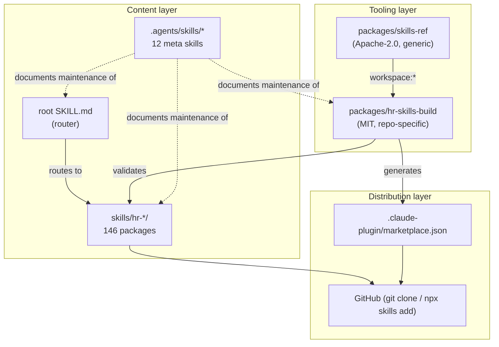

### Dependency graph (package-level)

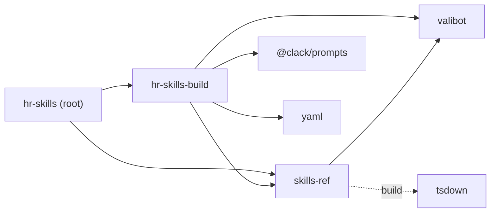

### Skill relationship map (cluster level)

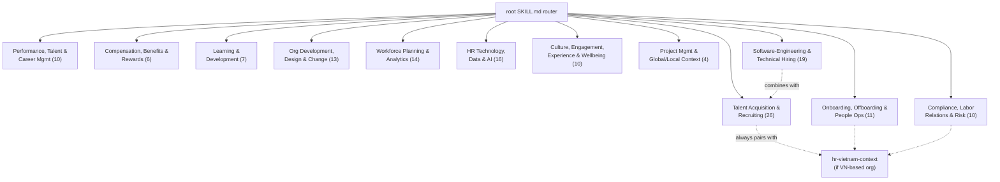

### Validation pipeline

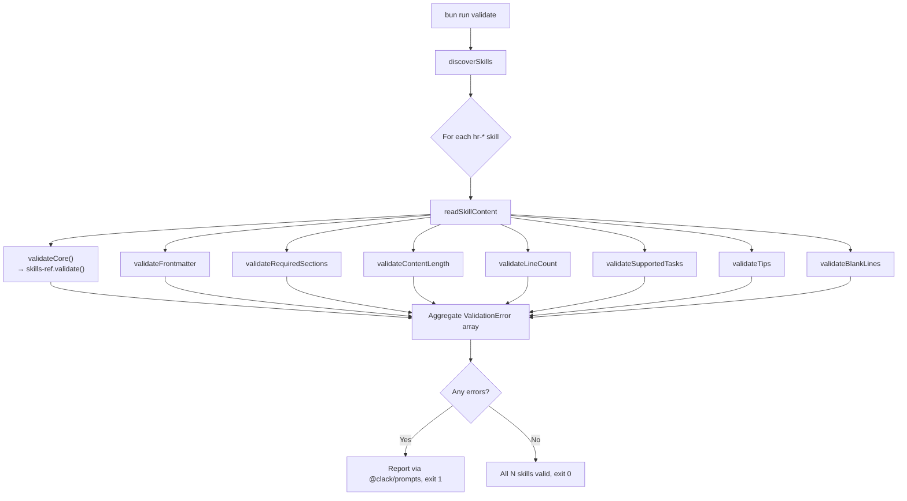

### Release pipeline (current, local-only)

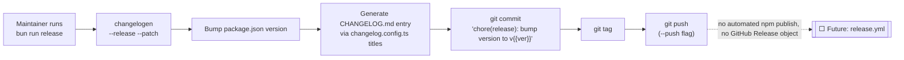

### Glossary

| Term | Meaning in this repo |
|---|---|
| **Skill** | A `SKILL.md` file (plus optional `content/`, `prompts/`, `examples/`) conforming to the Agent Skills format, scoped to one HR domain and prefixed `hr-`. |
| **Router** | The root `SKILL.md`, which carries no HR content and only maps requests to specialized skills. |
| **Meta skill** | A `.agents/skills/*` skill describing how to maintain the *repository itself* (Bun, Biome, Turbo, the router, etc.), consumed by AI coding agents rather than end-user HR requests. |
| **Bare skill** | A skill with only `SKILL.md`, no `content/`/`prompts/`/`examples/`. |
| **Full skill** | A skill with all three optional supporting directories. |
| **Sync** | `bun run sync` — regenerates `.claude-plugin/marketplace.json` from the current `skills/hr-*` directory listing. |
| **Validate** | `bun run validate` — runs the full 2-layer (generic + repo-policy) rule set against every discovered skill. |

---

*This roadmap was reverse-engineered directly from repository contents (configuration files, source code, tests, documentation, and CHANGELOG history) as of the repository snapshot provided. It should be re-derived or updated whenever the skill count, package structure, or CI configuration changes materially.*
